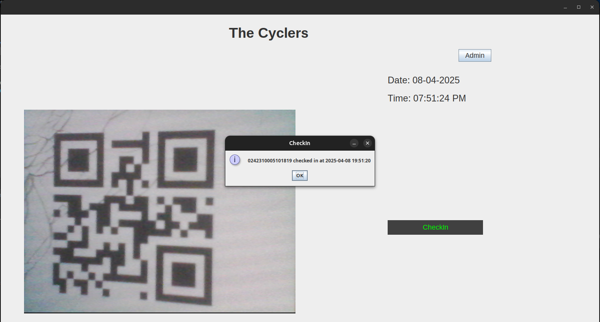
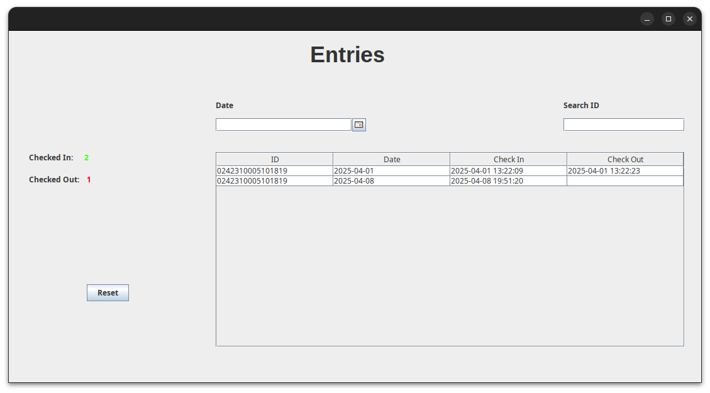

### **README.md**

# 🚲 The Cyclers - Automated Cycle Borrowing System

### **Overview**
The Cyclers is a user-friendly application designed to automate the cycle borrowing system on a university campus. The app aims to replace traditional manual processes like handwritten logs and inefficient QR code scanning with an **ID scanning solution** that integrates real-time tracking and management.

---

## **Key Features**
- 🔍 **ID Scanning**: Scan student IDs to borrow and return cycles instantly.  
- ⏳ **Borrow/Return Tracking**: Track borrowing times and calculate **extra charges** for late returns.  
- 📊 **Admin Dashboard**: Manage and view lending data efficiently using a MySQL database.  
- 🔄 **Search & Filter**: Search for specific IDs and filter data by date.  
- 📈 **Performance Focused**: Real-time updates and optimized database queries.  

---

## **Tech Stack**
| Component               | Technology                  |
|-------------------------|-----------------------------|
| **Frontend/UI**         | Java Swing (GUI)            |
| **Backend**             | Java                        |
| **Database**            | MySQL                       |
| **Tools & Utilities**   | BDUtility (Custom utility)  |
| **Version Control**     | Git/GitHub                  |

---

## **System Design**

### **Architecture Diagram**
```plaintext
User Interface (Java Swing)
        |
        v
Backend Logic (Java Classes)
        |
        v
Database (MySQL)
```

---

## **Screenshots**

### 1. **Main Dashboard**


### 2. **Admin View for Filtering and Searching Data**


---

## **Installation Guide**

### **Prerequisites**
Make sure you have the following installed on your machine:
- **Java Development Kit (JDK)**  
- **MySQL Database**  
- An **IDE** such as IntelliJ IDEA, Eclipse, or NetBeans  

### **Steps to Run**
1. **Clone the Repository**  
   ```bash
   git clone https://github.com/yourusername/The-Cyclers.git
   cd The-Cyclers
   ```

2. **Setup Database**  
   - Create a database in MySQL.
   - Import the provided SQL file (`db_script.sql`) to set up the necessary tables.

3. **Configure Database Connection**  
   Update your database credentials in the code.  
   ```java
   String url = "jdbc:mysql://localhost:3306/cyclers_db";
   String user = "your-username";
   String password = "your-password";
   ```

4. **Compile and Run**  
   - Open the project in your preferred IDE.  
   - Compile and run the main application file.  

---

## **Project Structure**

```plaintext
The-Cyclers/
│
├── src/
│   ├── main/
│   │   ├── BDUtility.java           # Custom utility class
│   │   ├── MainForm.java            # Main UI form
│   │   ├── DatabaseConnector.java   # Handles database connection
│   │   ├── BorrowManager.java       # Logic for managing borrowing
│   │   └── ...                      # Other classes
│
├── db/
│   └── db_script.sql                # MySQL database schema
│
├── images/                          # Screenshots or UI designs
│
└── README.md                        # Project documentation
```

---

## **Future Improvements**
- 🛒 **Integrate Payment Methods**: Automate late fees through online payment gateways.  
- 📱 **Mobile App Version**: Develop a cross-platform mobile app for enhanced user experience.  
- 🔐 **Enhanced Security**: Improve database security and user authentication.  
- 🌐 **Web Dashboard**: Add a web-based admin interface for more flexibility.

---

## **Contact**
For any queries or contributions, feel free to reach out:
- **Email**: devnahian749@gmail.com  

---
